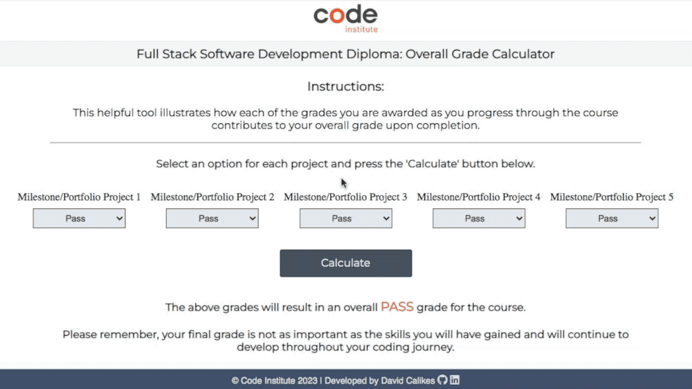
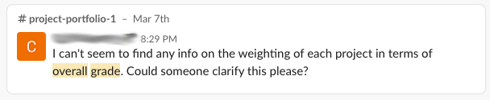

# CI Overall Grade Calculator

## Overview
The CI Overall Grade Calculator is a simple web application, designed for the benefit of current and future students undertaking the Code Institute's Full Stack Software Develpment Diploma course.

This helpful tool illustrates how each of the grades you are awarded as you progress through the course contributes to your overall grade upon completion.

 

Thoughtfully designed using HTML, CSS and JavaScript, the app is intuitive, fully responsive and has a style that is similar to other Code Institute web applications.

 

## Planning & Development

- __Project Inception__

    This project was inspired by the apparent need for clarification regarding the calculation of an overall grade for the Code Institute's Full Stack Software Development Diploma Course. As a student participating in the programme, I encountered many of my fellow learners looking for clarity on this issue via the code institute slack channel   

    
        
     

