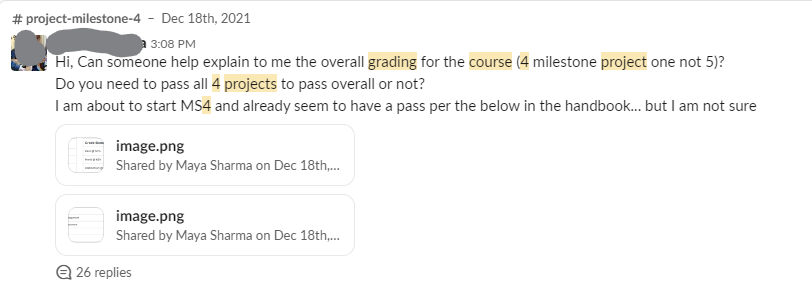

# CI Overall Grade Calculator

## Overview
The CI Overall Grade Calculator is a simple web application, designed for the benefit of current and future students undertaking the Code Institute's Full Stack Software Develpment Diploma course.

This helpful tool illustrates how each of the grades you are awarded as you progress through the course contributes to your overall grade upon completion.

 

Thoughtfully designed using HTML, CSS and JavaScript, the app is intuitive, fully responsive and has a style that is similar to other Code Institute web applications.

 

## Planning & Development

- __Project Inception__

    This project was inspired by the apparent need for clarification regarding the calculation of an overall grade for the Code Institute's Full Stack Software Development Diploma Course. As a student participating in the programme, I encountered many of my fellow learners looking for clarity on this issue via the code institute slack channel.   

    
   
    

     

    - __Target Audience__

    The Project Was designed for the following users.

    * Students who are undertaking the Level 5 Diploma in Web Development with Code Institute (4 'Milestone' Projects | Gateway).
    
    * Students who are undertaking the Diploma in Full Stack Software Development with Code Institute. (5 'Portfolio' Projects)

    * Cohort Facilitators who can signpost students to the tool.

    * Assigned Code Institute Mentors, who can use the tool to motivate high-functioning students towards achieving a higher overall grade.

 

- __Target Audiences Summary__
    
    * Users who are students who wish to understand how the grading system works.

    * Users who are students who wish to understand how any grades they have achieved so far will affect their overall grade.

    * Users who are students who wish to calculate what grades they require to achieve a specific outcome.

    * Users who are facilitators.

    * Users who are mentors.

- __User Stories__

    * As a user, I want to explore how the grading system works.
 
    * As a User, I want to make calculations quickly and without the need to reference external documents.
    
    * As a Code Institute staff user, I want calculate grades for different courses.

    * As a user, I want to have a positive emotional experience.

- __Site Objectives__

    * To make the purpose of the site obvious to the user.

    * To allow users to make calculations quickly and intuitively.

    * To make the site recognisable as a Code Institute application. 
    
    

- __Approach__

    * The information will be provided to the user logically and informed by planning research.  

    * The site will be created following the principles of user experience design.

    * The site will provide users links through which they can return to the CI LMS

    * The site will provide users with the option to choose between 2 courses.
    
    * The site will provide users with the functionality to calculate and project possible grades.

    * The content of the site will be inoffensive and accesible to all.

    * The site will be easy to navigate, intuitive and consistent in design.

